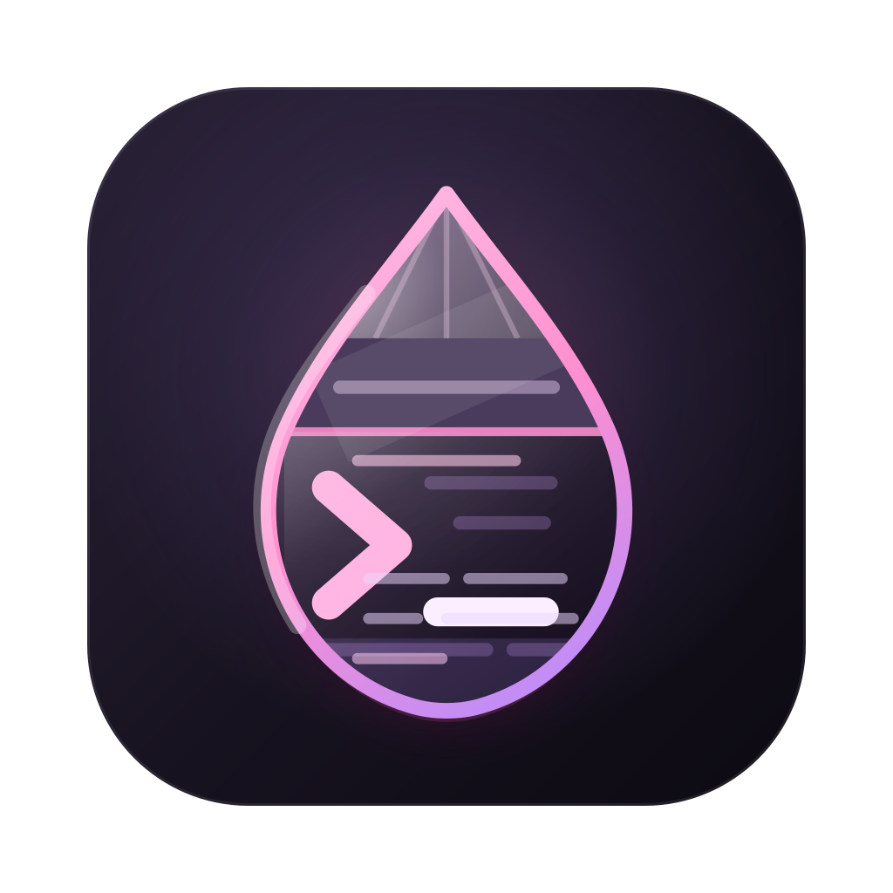

# quartz-drop

<p align="center">
  
</p>

[](https://github.com/SkeLLLa/quartz-drop/actions/workflows/ci.yml)
[](https://github.com/SkeLLLa/quartz-drop/releases/latest)
[](COPYING)
[](https://github.com/SkeLLLa/plasma-drop)

Dropdown windows for any Mac app, on a hotkey.

Press a shortcut and Terminal (or Finder, Safari, Notes, anything you like) appears in its spot,
say the left half of the screen, already focused. Press it again and it's gone. If the app isn't
running, quartz-drop starts it first. Think of a Quake-style dropdown terminal, but for every app
you use.

> **Setting up with an AI assistant?** Point it at [`README.ai.md`](README.ai.md). It contains
> step-by-step instructions written for agents.

## What you get

- **One hotkey per app.** It shows the app, focuses it, and hides it again.
- **Your layout, every time.** Each app goes to the same place: a half, a corner, a fixed size,
  a particular display.
- **One at a time.** Showing one app hides the others, so they never pile up.
- **Starts what's missing.** Press the hotkey for an app that isn't open and it opens.
- **Leaves no mess.** On quit, every window goes back where it was.
- **Quiet.** No Dock icon. There's a small menu bar icon, and you can hide that too.
- **A plain text config.** One TOML file that reloads as soon as you save it.

quartz-drop is the macOS version of [plasma-drop](https://github.com/SkeLLLa/plasma-drop) for KDE
Plasma, and reads the same config.

> [!NOTE]
> quartz-drop was converted from plasma-drop (Rust, KDE Plasma) to Swift and macOS with AI
> assistance.

## Install

You need macOS 13 (Ventura) or newer. Builds are universal, so they run on both Apple silicon and
Intel Macs.

1. Download the `.zip` from the
   [latest release](https://github.com/SkeLLLa/quartz-drop/releases/latest).
2. Unzip it and move `QuartzDrop.app` to your Applications folder.
3. If macOS says the app can't be opened, run this once in Terminal:

   ```bash
   xattr -dr com.apple.quarantine /Applications/QuartzDrop.app
   ```

   This is needed because releases aren't notarized by Apple yet.

<details>
<summary>Other ways to install</summary>

These put the `quartz-drop` command on your `PATH`. Running it starts the app.

With [mise](https://mise.jdx.dev) (2026.9.2 or newer):

```bash
mise use -g packslip:github.com/SkeLLLa/quartz-drop
```

With [packslip](https://packslip.dev) (1.5.1 or newer), which checks the release signature
before installing:

```bash
packslip install github.com/SkeLLLa/quartz-drop --pin ps1_3lbhdizx3fdmmm5ki37kzixcwy
```

From source, with [mise](https://mise.jdx.dev) and the Xcode Command Line Tools:

```bash
mise run bundle-universal
rm -rf /Applications/QuartzDrop.app   # quit quartz-drop first when upgrading
cp -R dist/QuartzDrop.app /Applications/
```

Homebrew isn't available yet. If you'd like to help, see the [roadmap](docs/roadmap.md).

</details>

## First run

1. Open QuartzDrop. It creates a starter config and opens its Settings window.
2. When asked, allow quartz-drop in System Settings → Privacy & Security → Accessibility. It needs
   this permission to move and resize other apps' windows.
3. Try a hotkey from the starter config:

   | Hotkey         | App                       |
   | -------------- | ------------------------- |
   | <kbd>⌃⌥F</kbd> | Finder, left half         |
   | <kbd>⌃⌥S</kbd> | Safari, right half        |
   | <kbd>⌃`</kbd>  | Terminal, top of screen   |
   | <kbd>⌃⌥N</kbd> | Notes                     |

4. To change them, choose **Open Config** from the menu bar icon. Changes apply when you save.

Want it running all the time? Turn on **Launch at login** in Settings → General.

> [!TIP]
> After an update, macOS may forget the Accessibility permission. If hotkeys stop moving
> windows, remove QuartzDrop from the Accessibility list and add it again.

More on settings, the menu bar menu, the command line and hotkey conflicts is in
[Getting started](docs/getting-started.md).

## Configure

The config is `~/.config/quartz-drop/config.toml`. Each `[[app]]` block is one app:

```toml
[[app]]
name = "finder"
hotkey = "ctrl+alt+f"
bundle_id = "com.apple.finder"

[app.placement]
width = "50%"
height = "100%"
position = "left"
```

To find an app's `bundle_id`, run `osascript -e 'id of app "Safari"'`.

The [starter config](resources/example-config.toml) has more examples, and
[Configuration](docs/configuration.md) lists every option.

### Coming from plasma-drop?

Copy your `config.toml` to `~/.config/quartz-drop/` and it loads unchanged. Linux-only options
are skipped, and Settings lists them. Then point `filename` or `bundle_id` at the Mac versions of
your apps. See [Using a plasma-drop config](docs/configuration.md#using-a-plasma-drop-config).

## Alternatives

- [Hammerspoon](https://www.hammerspoon.org): scriptable in Lua, can do all of this with code
- [Rectangle](https://rectangleapp.com): window layout only, no app toggling
- [Thor](https://github.com/gbammc/Thor) and [rcmd](https://lowtechguys.com/rcmd/): hotkeys to
  switch apps, no placement
- iTerm2 hotkey window: dropdown behavior for a single app

## Contributing

Ideas, bug reports and pull requests are welcome. The [roadmap](docs/roadmap.md) lists what's
missing, such as window animations and a Homebrew tap, and [Development](docs/development.md)
explains how to build and test:

```bash
mise run check   # everything CI runs: lint, build, tests
```

All documentation: [Getting started](docs/getting-started.md) ·
[Configuration](docs/configuration.md) · [Distribution](docs/distribution.md) ·
[Development](docs/development.md) · [Roadmap](docs/roadmap.md)

## Support

If `quartz-drop` is useful to you and you want to say thanks, please consider supporting Ukrainian
defenders instead of sending money to the author.

[](https://savelife.in.ua/en/donate-en/)
[](https://www.sternenkofund.org/en/donate)
[](https://prytulafoundation.org/en/donation)

The same links are in the menu bar menu and in Settings → General.

## License

GPL-3.0-or-later. See [COPYING](COPYING).
